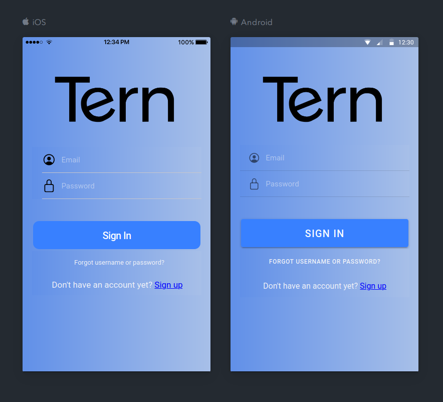
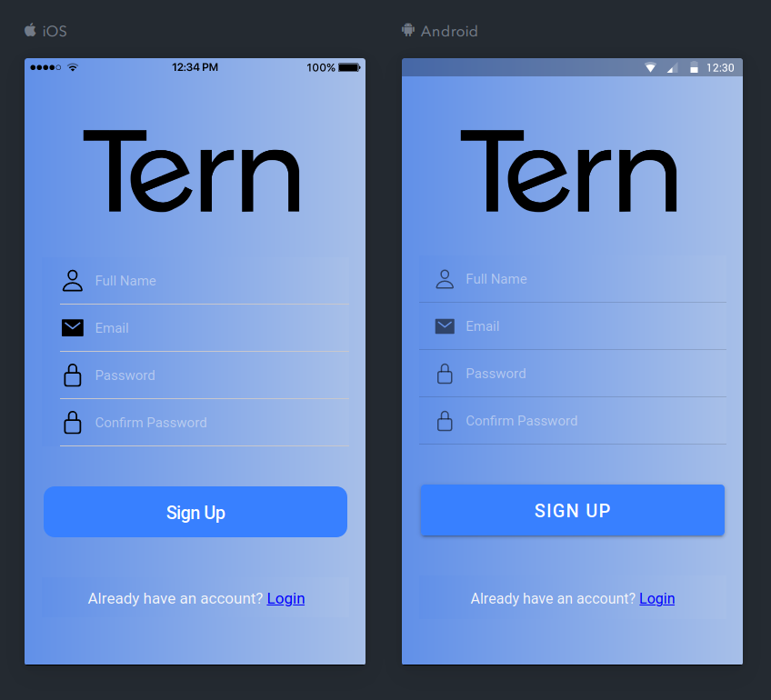

# Tern Mock

This application uses Ionic 4 and Angular 8 to showcase a login/signup module. You can hook it to a backend server for full-fleged authentication component. This is a work in progress, so you may encouter CSS rendering issues.

## Sign Up view


## Sign In view


# Get Started

```sh
npm install
ionic serve --lab
```
